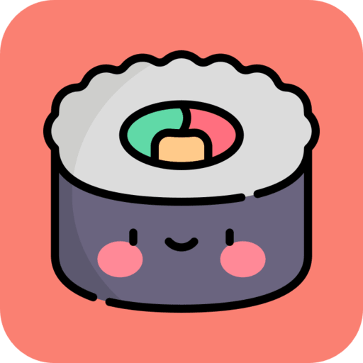

<div align="center">
<a href="https://anime.j21.dev">
  
<h1>Munchyroll</h1>
</a>
An ad-free anime streaming web app aimed at minimality and responsive design. 
<br />

### Live demo at [anime.j21.dev](https://anime.j21.dev)
<br />

 <a href="https://github.com/Jeydin21/Munchyroll/blob/master/LICENSE.md">
    
  </a>
  <a href="https://github.com/Jeydin21/Munchyroll/fork">
    
  </a>
  <a href="https://github.com/Jeydin21/Munchyroll/stargazers">
    
  </a>
  
</p>
</div>

## Images
<p align="center">
 
 
</p>

<details>
<summary>More Screenshots</summary>

<h3 align="center">Anime Home Page (Dark Mode)</h3>


<h3 align="center">Anime Info Page (Dark Mode)</h3>


<h3 align="center">Anime Watch Page (Dark Mode)</h3>


<h3 align="center">Manga Home Page (Light Mode)</h3>


<h3 align="center">Manga Info Page (Light Mode)</h3>


<h3 align="center">Manga Read Page (Light Mode)</h3>


</details>

## Features
- **No Ads** - No ads, no popups, no redirects, no bullshit
- **PWA Support** - Munchyroll has PWA (Progressive Web App) support, which means that you can add it to your home screren as an app
- **Time Responsive Background** - The background color changes based on what your local time is. It starts off at a rich yellow in the morning, blue in the afternoon, to a faded red in the evening, and space black in the night
- **Mobile Responsiveness** - The website will scale down to look good on mobile just as it does on desktop

## Bug Reports
If you encounter any strange bugs on the website, please let me know by  going to [issues](https://github.com/Jeydin21/Munchyroll/issues/) and create a bug report

## Local Development
> [!CAUTION]
> If you want to self host this app, please note that it's only allowed for personal use; **Commercial use is not recommended**

#### 1. Environment Variable file setup
1. Copy all the contents of `.env.example` into a new file called `.env`


#### 2. Backend Repository (Consumet API)
> [!TIP]
> If you already have a backend URL from somewhere, you can skip this step and go to step 3

1. Clone the backend repository and install the dependencies:
```bash
$ git clone https://github.com/consumet/api.consumet.org.git
$ cd api.consumet.org
$ npm install # Or yarn install
```

2. Start the backend server
```bash
$ npm start
```

3. Put your backend URL into the `NEXT_PUBLIC_CONSUMET_URL` variable in the `.env` file

#### 3. Frontend Repository (Munchyroll)
1. Clone this repository and install the dependencies:
```bash
$ git clone https://github.com/Jeydin21/Munchyroll.git
$ cd Munchyroll
$ npm install # Or yarn install
```

2. Start the development server
```bash
$ npm run dev
```
4. Open the project in your browser:
```
http://localhost:3000
```

#### Extra Steps (OPTIONAL)
- If you want, you can host a CORS proxy. The recommended CORS proxy for this project is this one: [Rob--W/cors-anywhere](https://github.com/Rob--W/cors-anywhere). You can host this on vercel and save the link into the `NEXT_PUBLIC_CORS_REQUEST_LINK` variable in the `.env` file
- You can turn on your own website tracking with Google Analytics, go to https://analytics.google.com/ and follow their setup instructions. Save the Tracking ID into the `NEXT_PUBLIC_GA_TRACKING_ID` variable in the `.env` file
- You can turn on your own website tracking with Umami, go to https://umami.is/ and follow their setup instructions. Save the Website ID into the `NEXT_PUBLIC_UMAMI_WEBSITE_ID` variable in the `.env` file
- You can turn on live customer communication with Tawk.to, go to https://tawk.to and follow their setup instructions. Save the Property ID and Widget ID into the `NEXT_PUBLIC_TAWKTO_PROPERTY_ID` and `NEXT_PUBLIC_TAWKTO_WIDGET_ID` variables, respectively

## Credits
- [Consumet API](https://github.com/consumet/api.consumet.org) for all anime details and sources
- [Anilist](https://anilist.co/) was used to provide extensive episode details and statistics

## License
This project is licensed under the GNU General Public License v3.0 - see the [License](https://github.com/Jeydin21/Munchyroll/blob/master/LICENSE) file for more details

## Contact
Thanks for checking my project out

If you have any questions or feedback, go to my [contact page](https://j21.dev/contact) and pick your preferred method of contact. You can also join the community Discord server I made down below:

[](https://discord.gg/JQsvHC4JUH)
